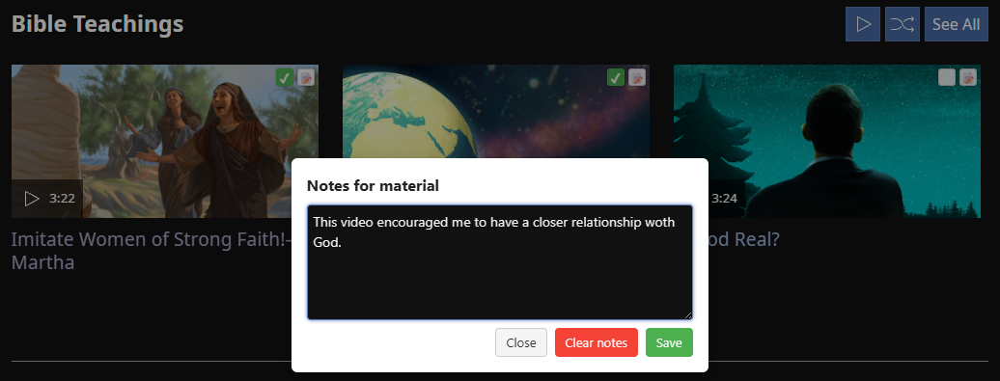

# Jw.org Personal Study



## Overview

This userscript adds extra functionality on top of the jw.org website.

### ✔ Video thumbnails
Video thumbnails now include:
- **Checkboxes** — mark videos you’ve already watched  
- **Notes icon** — add and save your personal notes for each video

### ✔ Other materials
Thumbnails of non-video materials include:
- **Checkboxes** to mark items you’ve already studied

### ✔ Bible reading tracker
Both **Bible book names** and **chapter links** include:
- **Checkboxes** so you can easily track your Bible reading progress


### ✔ Simple export/import of your notes and progress
You can easily **export all your notes and checked items** into a JSON file with one click.  
Later, you can **import the same file** to restore your study progress on another device or browser.


## Installation

### Windows (Edge/Chrome/Firefox)

1. **Install the Tampermonkey extension** for your browser:  
   - **Edge**: [Tampermonkey for Edge](https://microsoftedge.microsoft.com/addons/detail/tampermonkey/iikmkjmpaadaobahmlepeloendndfphd)  
   - **Chrome**: [Tampermonkey for Chrome](https://chrome.google.com/webstore/detail/tampermonkey/dhdgffkkebhmkfjojejmpbldmpobfkfo)  
   - **Firefox**: [Tampermonkey for Firefox](https://addons.mozilla.org/en-US/firefox/addon/tampermonkey/)  

2. **Enable Developer mode** for browser extensions:  
   - Official guide: [Tampermonkey – Developer mode FAQ](https://www.tampermonkey.net/faq.php#Q209)  
   - In Microsoft Edge, open: `edge://extensions/`  
     - Enable the **Developer mode** toggle  
     - Restart the browser

3. **Install the userscript into Tampermonkey**  
   - Open this RAW file in your browser:  
     ```
     https://raw.githubusercontent.com/lukastom/jworg-personal-study/main/jw-personal-study.user.js
     ```  
   - Tampermonkey automatically detects it and shows **Install** → click it  
   - After installation, restart the browser to ensure the script loads properly
  
### iOS (Safari)

1. Download the **Userscripts** app from the App Store. Run it.
2. Enable it as a Safari extension in **Settings → Safari → Extensions**. Allow it for all sites.
3. Place `jw-personal-study.user.js` into the **On My iPad → Userscripts** folder.
4. Open **jw.org** in Safari.
5. Tap the “aA” or "extensions" icon and enable the script under *Userscripts*.
6. Refresh the page.

